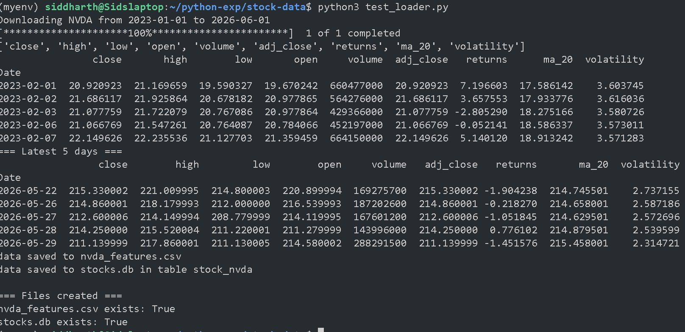

# python-experiments
Python projects exploring software development, machine learning, deep learning, NLP, computer vision, and quantitative finance.
# StockDataLoader

**Created:** 2026-06-01

A Python class to download, clean, and feature‑engineer historical stock data.

## What it does
- Fetches data from Yahoo Finance
- Cleans column names and removes missing values
- Computes daily returns (%), 20‑day moving average, and 20‑day volatility
- Exports to CSV and SQLite




# PyTorch Trainer Framework

A reusable training framework built with PyTorch that simplifies the training and evaluation of deep learning models.

## Features

* Training loop abstraction
* Validation and evaluation pipeline
* Automatic loss tracking
* Accuracy calculation
* CPU/GPU support
* Compatible with any PyTorch model
* Supports binary and multi-class classification

## Project Structure

```text
.
├── Trainer.py
├── test_trainer.py
└── README.md
```

## Components

### Trainer Class

The Trainer class handles:

* Model training
* Validation
* Loss computation
* Accuracy computation
* Device management (CPU/GPU)

### Training Workflow

```text
Dataset
   ↓
DataLoader
   ↓
Trainer
   ↓
Model
   ↓
Loss Function
   ↓
Backpropagation
   ↓
Optimizer
   ↓
Updated Weights
```

## Methods

### train_epoch()

Performs one complete training pass through the dataset.

Steps:

1. Forward pass
2. Loss computation
3. Backpropagation
4. Weight update
5. Loss accumulation

### evaluate()

Evaluates model performance on validation data.

Returns:

* Validation Loss
* Validation Accuracy

### fit()

Runs the complete training process for multiple epochs.

Example:

```python
trainer.fit(train_dl, val_dl, epochs=10)
```

## Example Usage

```python
import torch
from torch.utils.data import DataLoader, TensorDataset
from Trainer import Trainer

X = torch.randn(200, 10)
y = (X[:, 0] + X[:, 1] > 0).long()

train_ds = TensorDataset(X[:150], y[:150])
val_ds = TensorDataset(X[150:], y[150:])

train_dl = DataLoader(train_ds, batch_size=16, shuffle=True)
val_dl = DataLoader(val_ds, batch_size=32)

model = torch.nn.Linear(10, 2)

optimizer = torch.optim.Adam(
    model.parameters(),
    lr=0.01
)

loss_fn = torch.nn.CrossEntropyLoss()

trainer = Trainer(
    model,
    optimizer,
    loss_fn
)

trainer.fit(
    train_dl,
    val_dl,
    epochs=5
)
```

## Concepts Demonstrated

* Neural Network Training
* Backpropagation
* Gradient Descent
* Validation
* Classification
* Accuracy Metrics
* Loss Functions
* PyTorch DataLoaders

## Future Improvements

* Early Stopping
* Learning Rate Scheduling
* Model Checkpointing
* TensorBoard Integration
* Mixed Precision Training
* Progress Bars (tqdm)
* Confusion Matrix Metrics

## Technologies

* Python
* PyTorch

## Author

Siddharthzzz

